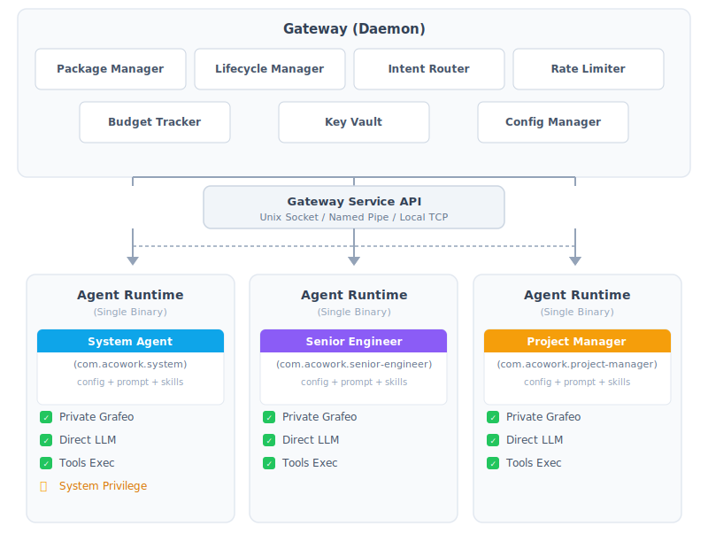

<h1 align="center">AgentCowork.AI — 和你的 agent 同事一起工作</h1>

<p align="center">
  
</p>

<p align="center">
  🏗️ <strong>声明式 Agent 平台 · 去中心化 · 高安全 · 可扩展</strong><br>
  ⚡️ <strong>Easy to build an agent colleague.</strong><br>
  ⚡️ <strong>Easy to share an agent colleague.</strong><br>
  ⚡️ <strong>Easy to deploy agent colleagues.</strong>
</p>

<p align="center">
  <a href="./LICENSE"></a>
  <a href="https://www.rust-lang.org"></a>
  <a href="./docs/"></a>
  <a href="./apps/acowork-desktop/"></a>
</p>

<p align="center">
  <a href="README.md">English</a>
</p>

---

<p align="center">
  <table>
    <tr>
      <td width="50%" align="center" valign="top">
        
        <br />
        <em>与多位 AI 同事协作——每位 Agent 拥有独立记忆、实时上下文感知和工具执行能力。</em>
      </td>
      <td width="50%" align="center" valign="top">
        
        <br />
        <em>全链路开发框架：迭代调试、Token 追踪、上下文快照，深入洞察 AI 推理过程。</em>
      </td>
    </tr>
  </table>
</p>

---

AgentCowork.AI 是一个**去中心化、高安全、可扩展的 AI Agent 运行时平台**。它不仅是一套开发框架，更是让你能够创造 **AI 同事**的平台——每个 Agent 都是拥有独立记忆、工作区和个性的自主数字存在，各自擅长不同领域，与你和其他 Agent 协作共进。

每个 Agent 都是独立的**"数字伙伴"**：拥有自己的运行时进程、私有记忆、工作区和配置，完全独立的个性化认知。就像身边有一支 AI 专家团队——有质量分析师、项目经理、高级工程师，各有所长、各司其职，通过平台的 Intent 机制沟通协调。

AgentCowork **同时服务于两类用户**：开发者通过三个维度的调优来构建 Agent——**Prompt、Tools 和 Memory**，普通用户从仓库安装使用。Agent 真正的智能来自系统提示词、可用工具和私有记忆中沉淀的经验三者之间的协同。签名工具链 + DevMode + 发布向导构成完整的开发者工具链，让**"调优 Prompt、Tools、Memory = 构建 AI 同事"**成为可能。

Agent 可在用户间自由分享——Personal/Sensitive 数据自动剥离，只带走 Agent 能力和记忆，不带走用户记忆。


### 🏪 Agent as APP — 像 Android 一样管理 AI

AgentCowork 将每个 Agent 视为手机上的**应用**。`.agent` 包就是完整自包含的应用——如同 APK。通用 Agent Runtime 是"操作系统"，Gateway 管理安装、生命周期、权限——如同应用商店。任何人都能以智能手机应用般的便捷度构建、分发和运行 AI Agent。

---

## 🏛️ 核心架构

### Android 类比

| Android         | AgentCowork         | 作用                                                  |
| --------------- | ------------------- | ----------------------------------------------------- |
| ART             | Agent Runtime       | 通用执行引擎（平台唯一二进制）                        |
| APK             | `.agent` 包         | 声明式打包（config + prompts + skills，无可执行代码） |
| APK Signature   | Signing Block       | 包签名，验证完整性和来源                              |
| AMS             | Gateway             | 生命周期管理（安装、启停、预算、速率）                |
| Binder IPC      | Gateway Service API | 进程间通信                                            |
| ContentProvider | 系统 Agent          | 系统级数据服务（身份、偏好）                          |
| PMS             | Package Manager     | 安装/卸载/升级                                        |

### 系统架构

<p align="center">
  
</p>

---

## 🔥 为什么选择 AgentCowork？

| 维度              | LangChain / CrewAI                    | OpenCode / OpenClaw                        | AgentCowork.AI                                          |
| ----------------- | ------------------------------------- | ------------------------------------------ | ------------------------------------------------------- |
| **架构模式**      | Library/Framework：你的代码调它的 API | Coding Agent（TUI/CLI）：单Agent、任务聚焦 | **Agent 平台**：声明式 `.agent` 包，通用 Runtime 二进制 |
| **Agent 模型**    | 代码定义 Agent（Python/TS）           | 内置 Agent（build/plan）、Skill 化         | **声明式 Agent**：config + prompt + SKILL.md，零代码    |
| **Agent 隔离**    | 进程内隔离（线程/协程）               | 进程级，单一 Runtime                       | **进程级隔离**：每个 Agent 独立进程 + 私有 Grafeo       |
| **LLM 连接**      | 代码管理 LLM 调用                     | 每个 Agent 直连                            | **Agent 直连**：每个 Agent 直接访问 LLM API，不经代理   |
| **记忆系统**      | 简单 RAG 或向量存储                   | 会话范围 / 插件依赖                        | **仿生分层**：三层五类（Grafeo 图数据库驱动）           |
| **隐私分享**      | 缺乏隐私边界控制                      | 包级分享                                   | **Zone 隔离**：分享时 Personal/Sensitive 数据自动剥离   |
| **分发模型**      | pip包 / Docker镜像                    | npm / brew / 脚本安装                      | **`.agent` 包**：签名 + 仓库分发，类 APK 体验           |
| **多 Agent 协作** | 代码级编排                            | 有限（内置 Agent）                         | **Intent 机制**：Capability Registry + 消息路由         |
| **安全体系**      | 框架层权限检查                        | 工具级审批门                               | **包签名 + 进程沙箱 + WASM 沙箱**三层防护               |

---

## 🚀 快速开始

### 前置依赖

- [Rust](https://rustup.rs/)（nightly）
- [Node.js](https://nodejs.org/) >= 18
- 本地运行的 [Gateway + Runtime](https://github.com/tranxon/acowork-ai#-running-the-backend)

### 快速开始

```bash
git clone https://github.com/tranxon/acowork-ai.git
cd acowork-ai

# 1. 启动后端服务（Gateway + Runtime）
cd core && cargo build --release
# 运行 target/release/ 下的 Gateway 和 Runtime 二进制

# 2. 启动桌面应用（浏览器模式）
cd ../apps/acowork-desktop
npm install
npm run dev      # → http://localhost:5173

# 3. 或构建完整 Tauri 桌面应用
cd ../apps/acowork-desktop
npm install
npm run tauri dev
```

### 编写第一个 Agent

只需一个 `manifest.toml` + 一个 prompt 文件：

```toml
# com.example.qa-agent/manifest.toml
[package]
id = "com.example.qa-agent"
name = "Quality Assurance"
display_name = "QA-Tom"
role = "QA"
version = "1.0.0"

[llm]
provider = "deepseek"
model = "deepseek-v4-flash"

[permissions]
tools = ["web_search", "read_file", "write_file"]
```

```markdown
# prompts/system.md
你是一个QA，擅长帮助用户做质量管理。
```

### 打包、签名、运行

```bash
# 打包为 .agent 包
acowork-sign package ./qa-agent/ -o qa-agent.agent

# 安装到本地 Gateway 并运行
acowork-gateway install qa-agent.agent
acowork-gateway start com.example.qa-agent

# 聊天模式
acowork-gateway chat --agent com.example.qa-agent "帮我审查代码"
```

> **现状**：项目处于**设计阶段**，核心 Rust crate 已定义但实现尚未完成。以上为最终 API 设计目标。

---

## ✨ 核心特性

### 🧩 标准化打包
Agent 以 `.agent` 压缩包分发，内含 manifest.toml、Prompts、Skills、工具声明，**不含可执行文件**。所有包必须签名，Gateway 安装时强制验证。

```
<agent_id>.agent
├── manifest.toml          # 元数据 + LLM 配置 + 权限 + 工具声明
├── prompts/               # System prompt 模板
├── config/                # 默认配置文件
├── data/                  # 初始数据
├── skills/                # Skill 定义（YAML frontmatter + Markdown）
├── tools/                 # 自定义工具（WASM，可选）
└── resources/             # 图标、本地化等
```

包必须签名（APK Signature Scheme v2 思路），Phase 1 支持两类签名身份：Developer（自签名）和 Platform（系统 Agent 专用）。

### ⚙️ 统一执行引擎
Agent Runtime 是平台提供的**唯一二进制**，负责加载 `.agent` 包并执行 LLM 交互、工具调度、记忆读写。Agent **直连 LLM API**，不经 Gateway 代理——不仅减少延迟，更保证了去中心化。

### 🔒 进程级隔离
每个 Agent 由 Gateway 启动为**独立进程**，各自拥有：
- 独立工作区
- 私有 Grafeo 图数据库
- 文件系统隔离
- 可选的资源限制（CPU/内存/网络）

### 🧠 仿生记忆系统
每个 Agent 内嵌私有 Grafeo，实现**三层五类**仿生分层记忆：

| 层级     | 内容                 | 生命周期 | 说明                                        |
| -------- | -------------------- | -------- | ------------------------------------------- |
| 🟢 瞬态层 | 工作记忆             | 单次会话 | 对话历史、LLM 上下文窗口                    |
| 🟡 经历层 | 情景记忆             | 持久化   | Episode 节点、关联扩散检索、内容分类压缩    |
| 🔴 沉淀层 | 语义/程序/自传体记忆 | 长期     | 知识图谱、跨 Skill 通用行为、六维度自我认知 |

- **Grafeo 原生 HNSW 向量索引 + BM25 全文检索 + 混合搜索**
- **关联扩散检索**：从用户查询出发沿图扩散，非简单的 Top-K 语义匹配
- **Compaction 即 Distillation**：上下文压缩与记忆蒸馏统一为单次 LLM 调用
- 每个 Agent 拥有完全独立的私有 Grafeo，不存在公共数据库

### 🔄 隐私安全分享
Agent 可自由分享给其他用户。**Personal/Sensitive 节点在打包时自动剥离**，只带走 Agent 能力（Skill、行事风格、知识）而非用户记忆（偏好、历史、私密信息）。Zone 语义作用于打包分享边界，不影响跨设备同步。

### 💬 Intent 通信
跨 Agent 通信通过 Gateway 的 Intent Router 实现，支持：
- **Capability Registry**：Agent 声明自己"能做什么"
- **同步/异步模式**：支持请求-响应和事件驱动
- **变更订阅（observe）**：Agent 可订阅其他 Agent 的状态变更

### 🛡️ 三层安全体系
1. **包签名**：所有 `.agent` 包必须签名，安装时强制验证
2. **进程沙箱**：操作系统级进程隔离 + 文件系统隔离
3. **WASM 沙箱**：自定义工具在 Wasmtime 沙箱中执行，无法逃逸

### 🛠️ 全链路开发框架
Desktop App（Tauri v2）提供：
- 对话调试（真实 LLM 或本地模型）
- Skill 热加载（修改 SKILL.md 无需重启）
- Provider 动态切换
- 断点 / 录制回放
- Agent 克隆与发布向导

---

## 📦 Agent 开发流程

```
① 编写
  manifest.toml          # 元数据、权限、LLM 配置
  prompts/               # System prompt 模板
  skills/SKILL.md        # 技能定义（兼容 agentskills.io）
  可选：tools/*.wasm     # WASM 自定义工具

② 签名
  acowork-keygen        # 生成 Developer Key
  acowork-sign          # 签名 .agent 包

③ 调试
  Desktop App DevMode
    ├─ 安装到本地（Gateway 验证签名）
    ├─ 对话调试（真实 LLM 或本地模型）
    ├─ 断点 / 录制回放
    ├─ SKILL.md 热加载（修改即时生效）
    └─ 单步执行 Skill 步骤

④ 发布
  发布向导 → 远程仓库（Phase 2+ 仓库分发）
  或直接分享 .agent 文件（接收方验证签名后安装）
```

开发者通过**调优声明式配置**来构建 Agent——设计系统提示词、声明工具能力、调整记忆行为——而非编写命令式代码。整个流程从编写到调试到发布，平台提供完整工具支撑。

---

## 📈 项目状态与路线图

> 当前状态：**Alpha 阶段**。核心 Gateway、Runtime、Grafeo 记忆引擎和 Desktop UI 正在积极开发中。架构设计文档见 [docs/](docs/)。

| 阶段    | 内容                                                                                                       | 状态     |
| ------- | ---------------------------------------------------------------------------------------------------------- | -------- |
| Phase 1 | 基础框架 + LLM 交互（MVP）：包解析、签名验证、Runtime 主循环、循环检测、Tool 去重、Rate 分层、Gateway 基础 | 🚧 进行中 |
| Phase 2 | Memory 分层 + 系统 Agent：Grafeo 仿生分层、即时提取、关联扩散、AutobiographicalNode                        | 🚧 进行中 |
| Phase 3 | 权限与沙箱：文件系统隔离、WASM 沙箱（Wasmtime）、Approval Gate                                             | 📝 设计中 |
| Phase 4 | 通信与协调：Intent、Budget Tracker、Rate Limiter、Cron                                                     | 📝 设计中 |
| Phase 5 | Desktop App + 开发框架：Debug Protocol、Skill 热加载、录制回放                                             | 🚧 进行中 |
| Phase 6 | 云端与生态：Memory Sync、远程仓库、Agent 商店                                                              | 🔮 规划中 |
| Phase 7 | 跨平台适配：Windows / macOS / Android / iOS                                                                | 🔮 规划中 |

### 核心 Crate 架构

AgentCowork 采用 **7-crate Rust workspace** 架构：

| Crate                                          | 职责                                           | 状态     |
| ---------------------------------------------- | ---------------------------------------------- | -------- |
| [`acowork-core`](./core/acowork-core/)       | 共享类型、错误、配置                           | 🚧 进行中 |
| [`acowork-runtime`](./core/acowork-runtime/) | Agent Runtime：主循环、工具调度、Provider      | 🚧 进行中 |
| [`acowork-gateway`](./core/acowork-gateway/) | Gateway：包管理、生命周期、Intent 路由         | 🚧 进行中 |
| [`acowork-grafeo`](./core/acowork-grafeo/)   | 图数据库引擎：HNSW 索引、BM25 检索、ACID 事务  | 🚧 进行中 |
| [`acowork-memory`](./core/acowork-memory/)   | 记忆管理层：MemoryStore trait、Compaction 调度 | 🚧 进行中 |
| [`acowork-vault`](./core/acowork-vault/)     | 加密密钥值存储                                 | 🚧 进行中 |
| [`acowork-sign`](./core/acowork-sign/)       | 包签名与验证                                   | 🚧 进行中 |

---

## 📚 设计文档

> 完整的架构设计文档在 [`docs/design/`](./docs/design/) 目录下，模块级设计在 [`docs/module-design/`](./docs/module-design/)。

| 文档                                                                           | 内容                                                                             |
| ------------------------------------------------------------------------------ | -------------------------------------------------------------------------------- |
| [01-overview.md](./docs/design/01-overview.md)                                 | 平台总纲：背景目标、核心类比、架构总览、与现有方案对比                           |
| [02-agent-package.md](./docs/design/02-agent-package.md)                       | `.agent` 包格式、签名机制、manifest.toml 架构                                    |
| [03-agent-runtime.md](./docs/design/03-agent-runtime.md)                       | Agent Runtime 主循环、上下文构建、循环检测、Approval Gate                        |
| [04-gateway.md](./docs/design/04-gateway.md)                                   | Gateway 组件：PackageManager、Lifecycle、IntentRouter、Vault、Budget、Rate、沙箱 |
| [05-memory.md](./docs/design/05-memory.md)                                     | Memory 仿生分层：三层五类、Grafeo 知识图谱、遗忘机制、关联扩散检索               |
| [06-communication.md](./docs/design/06-communication.md)                       | Gateway Service API + Intent 通信协议 + Capability Registry                      |
| [07-system-agent.md](./docs/design/07-system-agent.md)                         | 系统 Agent：ContentProvider、冷启动身份注入                                      |
| [08-security.md](./docs/design/08-security.md)                                 | 安全设计：进程隔离、文件隔离、签名验证、WASM 沙箱                                |
| [10-debug-protocol.md](./docs/design/10-debug-protocol.md)                     | Debug Protocol：DevMode、执行控制、断点系统、消息快照与回滚                      |
| [12-tool-system.md](./docs/design/12-tool-system.md)                           | 工具系统：Built-in Tools、WASM 沙箱、Gateway Tools                               |
| [13-skill-system.md](./docs/design/13-skill-system.md)                         | 技能系统：SKILL.md 格式、Grafeo 经验层、自学习闭环                               |
| [14-desktop-app.md](./docs/design/14-desktop-app.md)                           | Desktop App：Tauri v2、系统托盘、开发者模式                                      |
| [15-conversation-persistence.md](./docs/design/15-conversation-persistence.md) | 对话持久化：Session Actor 模型、JSONL、Token 预算                                |

### 架构决策记录（ADR）

| 文档                                                                | 决策                       |
| ------------------------------------------------------------------- | -------------------------- |
| [ADR-009](./docs/adr/ADR-009-gateway-workspace-isolation.md)        | Gateway 工作空间隔离       |
| [ADR-010](./docs/adr/ADR-010-context-compression-simplification.md) | 上下文压缩策略简化         |
| [ADR-011](./docs/adr/ADR-011-compaction-as-distillation.md)         | Compaction 即 Distillation |

### 模块级设计

| 文档                                                      | 内容                             |
| --------------------------------------------------------- | -------------------------------- |
| [00-overview.md](./docs/module-design/00-overview.md)     | 模块概览：7-crate workspace 结构 |
| [01-core.md](./docs/module-design/01-core.md)             | acowork-core 设计               |
| [02-runtime.md](./docs/module-design/02-runtime.md)       | acowork-runtime 设计            |
| [03-gateway.md](./docs/module-design/03-gateway.md)       | acowork-gateway 设计            |
| [04-grafeo.md](./docs/module-design/04-grafeo.md)         | acowork-grafeo 设计             |
| [05-vault-sign.md](./docs/module-design/05-vault-sign.md) | acowork-vault / sign 设计       |

---

## 🧪 参考与致谢

AgentCowork.AI 的设计深受以下开源项目启发：

| 项目                                                    | 领域          | 借鉴点                                     |
| ------------------------------------------------------- | ------------- | ------------------------------------------ |
| [ZeroClaw 🦀](https://github.com/zeroclaw-labs/zeroclaw) | Agent Runtime | Trait 驱动架构、安全装饰器模式、流式解析器 |
| [Grafeo](https://github.com/GrafeoDB/grafeo)            | 图数据库      | HNSW 向量索引、BM25 全文检索、混合搜索     |
| [Mem0](https://github.com/mem0ai/mem0)                  | 记忆层        | 多层级记忆、用户/会话/Agent 状态管理       |
| [HippoRAG](https://github.com/OSU-NLP-Group/HippoRAG)   | 记忆框架      | 神经生物学启发长时记忆、关联扩散检索       |
| [LightMem](https://github.com/zjunlp/LightMem)          | 记忆框架      | 轻量级记忆压缩、结构化记忆管理             |
| [OpenCode](https://github.com/anomalyco/opencode)       | Coding Agent  | 多 Agent 协作模式、Provider 无关设计       |

> ZeroClaw 为参考实现（`ref-repo/zeroclaw/`），非 AgentCowork.AI 设计的 Source of Truth。代码复用遵循 MIT / Apache-2.0 许可证要求。

---

## 🤝 贡献

项目目前处于 **Alpha 阶段**。欢迎参与讨论和设计审查：

- 在 `docs/review/` 中查看已有的设计评审报告
- 通过 issue 提交设计反馈
- 阅读 [AGENTS.md](./AGENTS.md) 了解项目约定

---

## 📄 License

Apache-2.0 — 详见 [LICENSE](./LICENSE) 文件。

---

<p align="center">
  <b>AgentCowork.AI — 与你的 AI 同事协作</b><br>
  <i>像组建团队一样构建和协作 AI 伙伴。</i>
</p>